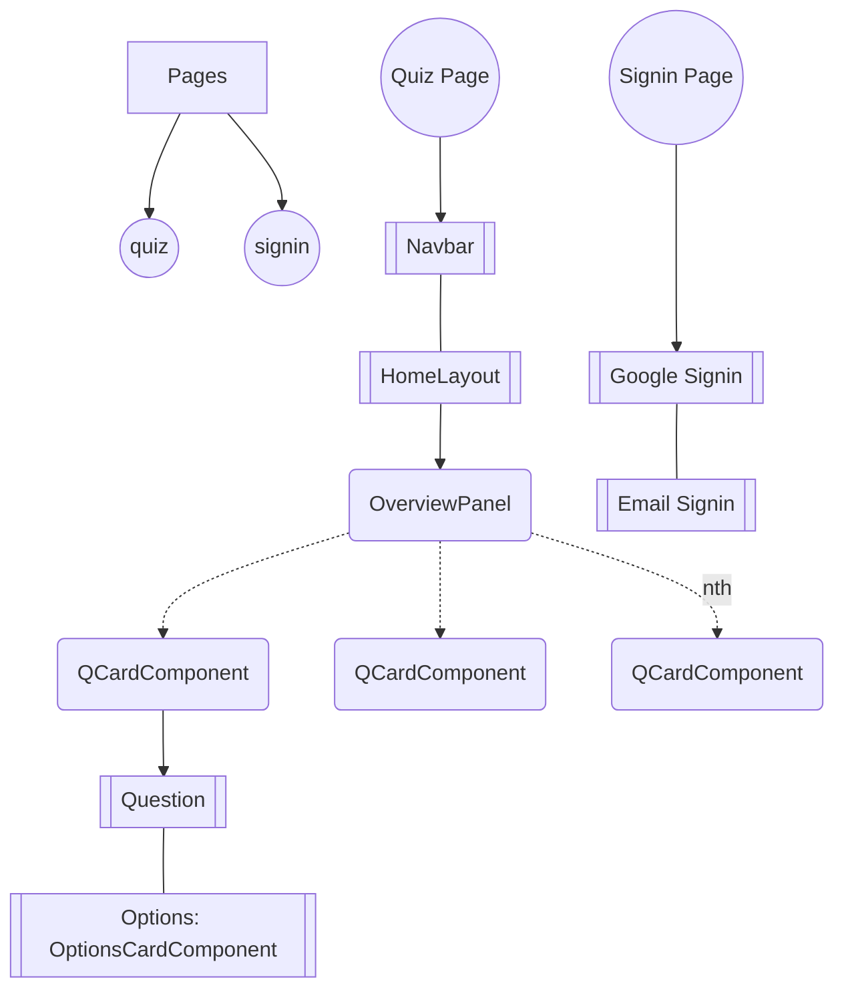

# Project Name: Quiz App

## Table of Contents
- [Overview](#overview)
- [Images](#images)
- [Project Structure](#project-structure)
- [My Approach](#my-approach)
- [Features](#features)
- [Future Works](#future-works)

---

## Overview 
The **Quiz App** is a web application built using Next.js that allows users to take quizzes after signing in. It features a user-friendly interface with a timer, question overview, and detailed performance analysis.

---

## Images


---

## Project Structure

---

## Features 
- User authentication for accessing quizzes.
- A timer that counts down 30 minutes as soon as questions are fetched.
- An option to end the quiz manually if the user completes it before the timer expires.
- Display of individual quiz questions with an overview panel.
- Ability to navigate between questions using arrow keys or by clicking on questions in the overview panel.
- Scoring system with color-coded performance indicators (red, orange, and green).
- Detailed reports on individual questions, highlighting incorrect and correct answers.
- Context-based data management for efficient functionality.
- User session management using Next-Auth for authentication.
- Responsive design for use on various devices.

---

## My Approach 
I was assigned the FullStack Developer Internship project at CausalFunnel. Here's a breakdown of my approach to creating the project:

**1. Initial Setup**
I began by identifying the essential routes for the project, which included /signin and /routes.

**2. User Authentication**
My next step was to implement user sign-in functionality and manage user sessions using next-auth. Initially, I was required to collect only the user's email, but I expanded this by also integrating Google Sign-In for a more versatile sign-in process.
<ins>Quiz Structure</ins>: To structure the quiz page, I divided it into different layers for better organization and functionality.

**3. Navbar Layer**
The first layer included the navigation bar, which featured:
- A timer
- An end button
- A user button that, when clicked, displayed options for signing out.
When the timer reached its end, the quiz would automatically submit, and the user's score would be displayed. Alternatively, the user could manually end the quiz and receive a score by clicking the "endQuiz" button.

**4. HomeLayout Component**
The second layer was the HomeLayout component, which could be further divided into two components:
- <ins>OverviewPanel</ins>: This component displayed all the questions with dynamic color changes to indicate their status (solved, unsolved, or in progress). It was visible when the user was actively taking the quiz or reviewing detailed quiz results but not when only the summary with the score was shown.
- <ins>QCardComponent</ins>: This component represented a question card, one at a time, which could be navigated backward or forward using the left and right arrow keys on either side of the question card.

**5. OptionsCardComponent**
Within the QCardComponent, I implemented the OptionsCardComponent. This component handled the display of answer options. It received the options from the API in a separate format for correct and wrong answers, combined them, shuffled them, and presented them to the user. It also dynamically changed the color of the selected option. During the review process, it displayed the options with dynamically changing backgrounds and borders to indicate the user's selections and the correct answer. For example, if the user selected the wrong option, it would be marked in red, while the correct option would be highlighted in green.

**6. Data Management**
To efficiently pass important data between components, I used React Context. This allowed for seamless communication and interaction within the application.

In summary, my approach to the project involved setting up user authentication, creating a structured quiz page with multiple layers for navigation and presentation, and managing data flow between components using React Context for a more organized and functional application.

--

## Future Works
- Implement server-side storage to store quiz data, allowing users to resume quizzes even after a reload.

---

This is a [Next.js](https://nextjs.org/) project bootstrapped with [`create-next-app`](https://github.com/vercel/next.js/tree/canary/packages/create-next-app).

## Getting Started with Nextjs Project
First, install the dependencies:
```bash
npm i
# or
yarn add
```

Second run the development server:
```bash
npm run dev
# or
yarn dev
# or
pnpm dev
# or
bun run dev
```

Open [http://localhost:3000](http://localhost:3000) with your browser to see the result.

You can start editing the page by modifying `app/page.tsx`. The page auto-updates as you edit the file.

This project uses [`next/font`](https://nextjs.org/docs/basic-features/font-optimization) to automatically optimize and load Inter, a custom Google Font.

## Learn More

To learn more about Next.js, take a look at the following resources:

- [Next.js Documentation](https://nextjs.org/docs) - learn about Next.js features and API.
- [Learn Next.js](https://nextjs.org/learn) - an interactive Next.js tutorial.

You can check out [the Next.js GitHub repository](https://github.com/vercel/next.js/) - your feedback and contributions are welcome!

## Deploy on Vercel

The easiest way to deploy your Next.js app is to use the [Vercel Platform](https://vercel.com/new?utm_medium=default-template&filter=next.js&utm_source=create-next-app&utm_campaign=create-next-app-readme) from the creators of Next.js.

Check out our [Next.js deployment documentation](https://nextjs.org/docs/deployment) for more details.
